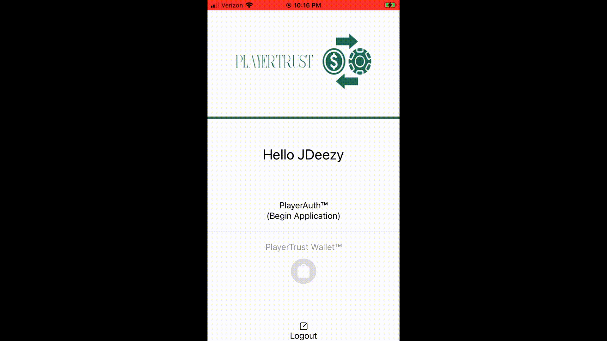
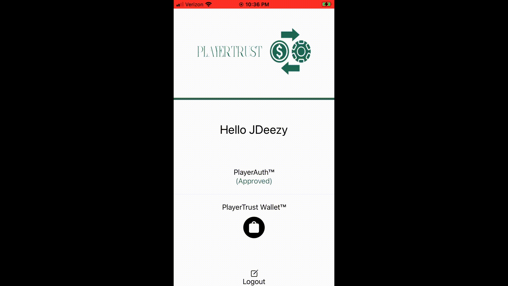
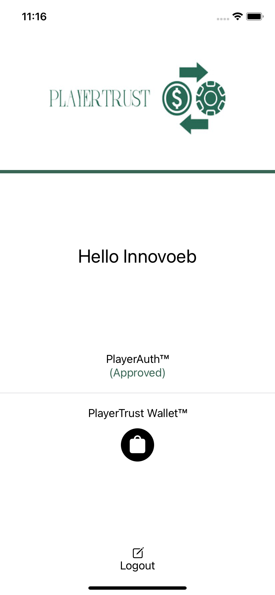
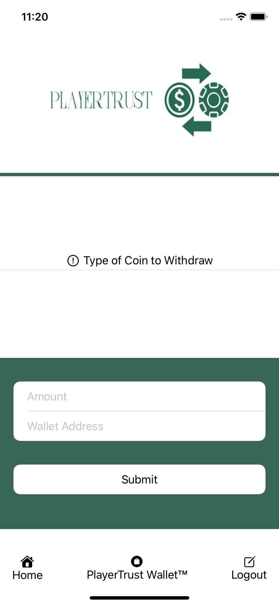
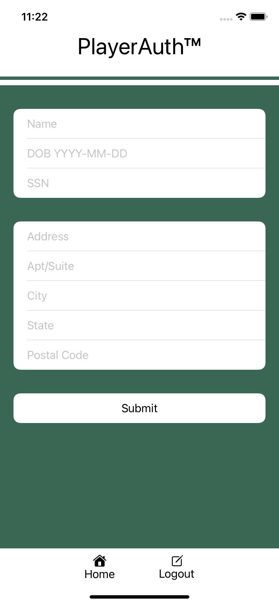
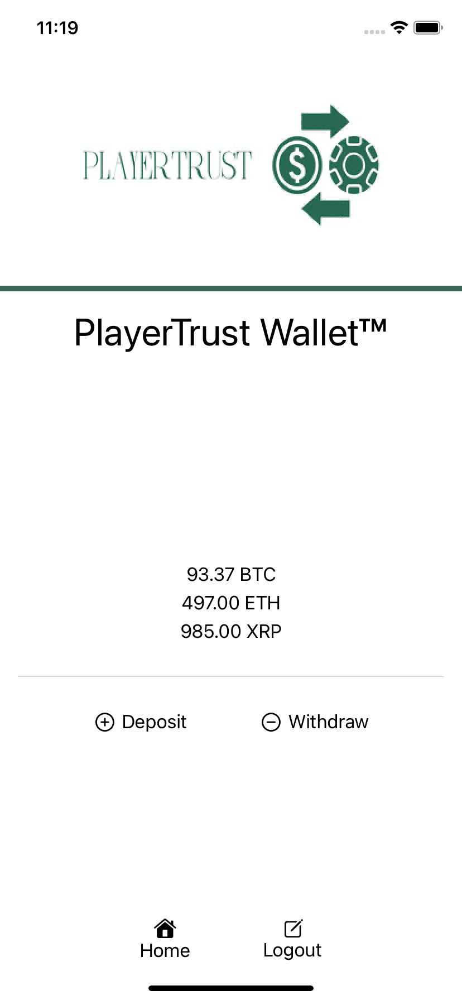

## a cryptocurrency/fintech iOS prototype application

***

***

KYC Verification (PlayerAuth™)              |  Deposit/Withdraw Crypto (PlayerTrust Wallet™)
:-------------------------:|:-------------------------:
 |  
 | 

***

## **Youtube Playlist**

Account Creation & PlayerAuth™ Onboarding\
\
PlayerTrust Wallet™\

***

## **About** 

   The PlayerTrust mobile app would be one of the many products offered by the hypothetical PlayerTrust fintech company such as the PlayerTrust API, PlayerTrust web portal, and the PlayerTrust widget (front-end web interface). This prototype; the PlayerTrust mobile app, would be an interface that would allow an end user to become KYC (Know Your Customer) authorized (PlayerAuth) and open a crypto wallet (PlayerTrust Wallet) which would enable them to gamble on online casino sites with cryptocurrency by simply logging into their PlayerTrust account using the PlayerTrust widget. This widget, as well as other products such as the PlayerTrust API and PlayerTrust web portal, would be integrated/used by legal online casino sites and in effect make the PlayerTrust business model be a B2B sales model. This model would be very similiar to models used by other fintech services such as Plaid, PayPal, and Zelle where these providers enable FIAT payment rails. The difference being PlayerTrust would enable crypto payment rails specifically for online gambling companies.

**Note:** This project was solely made as a way to demonstrate my newly acquired knowledge and skills in iOS development using the Swift language and SwiftUI framework as well as other third party tools listed below. This application shall not be considered a MVP (Minimum Viable Product), it is only a proof of concept prototype using dummy data. The functionalities of KYC verification and crypto deposit/withdraw are all simulated.

***

## **Made With**

***

